# 【僵尸毁灭工程】关于面向对象的类型提示增强

本项目是用于僵尸毁灭工程 mod 开发，关于面向对象的类型提示增强。

解决了继承原版代码对象后没有提示的问题。

## 效果展示

### 使用前：

设置：（没有添加类型提示增强）
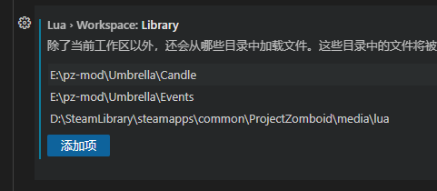

类型提示表现：
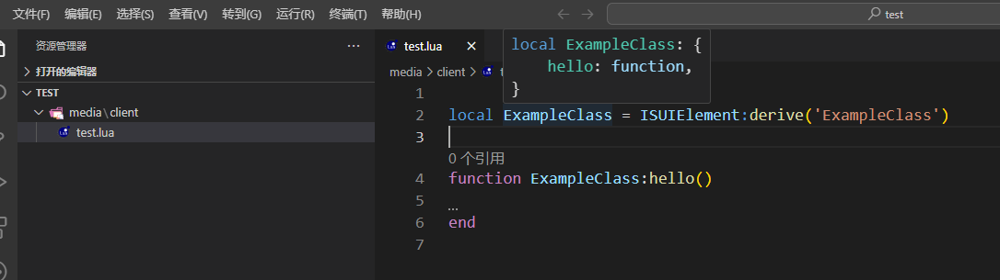
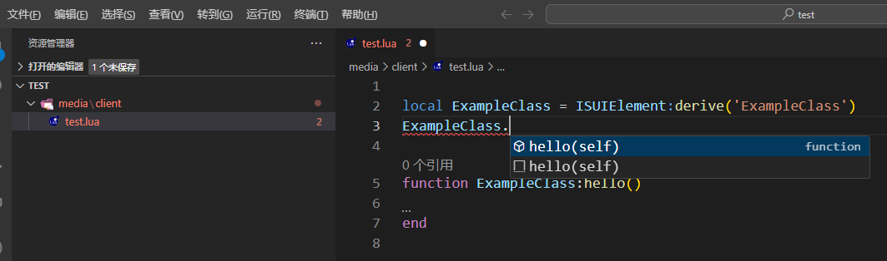
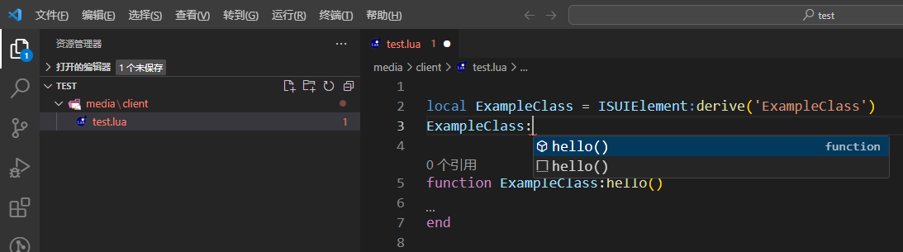
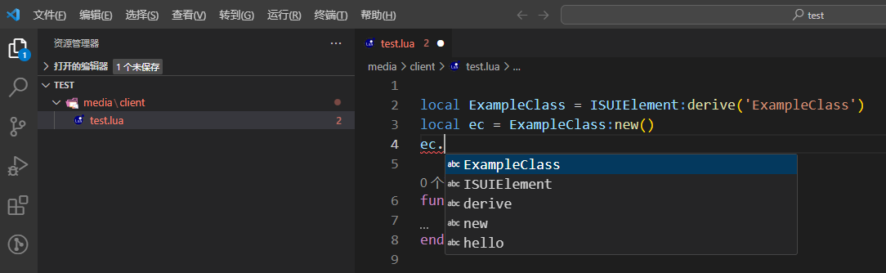
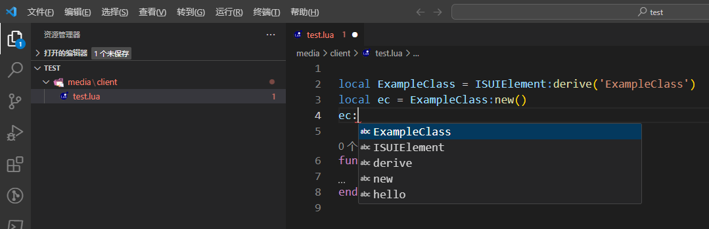

### 使用后：

设置：（添加了类型提示增强）
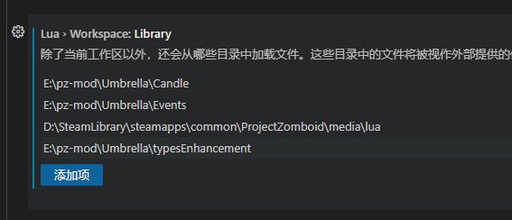

类型提示表现：
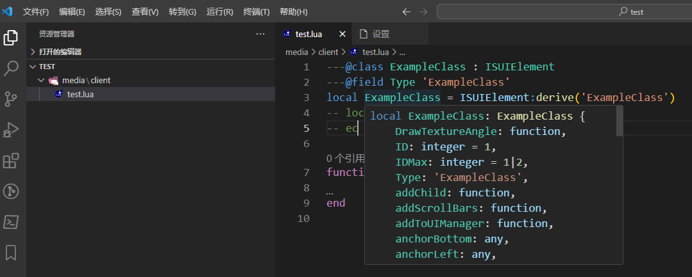
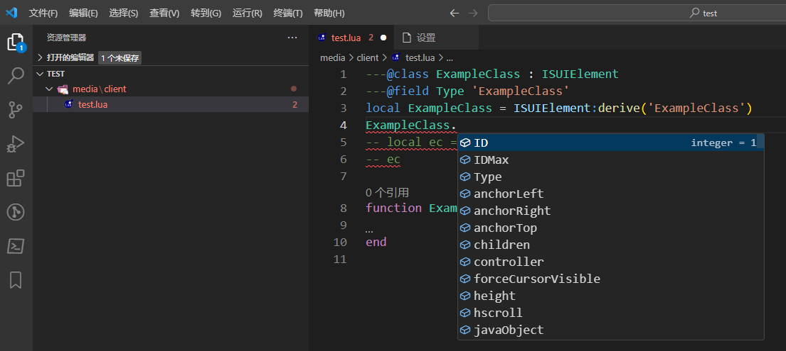
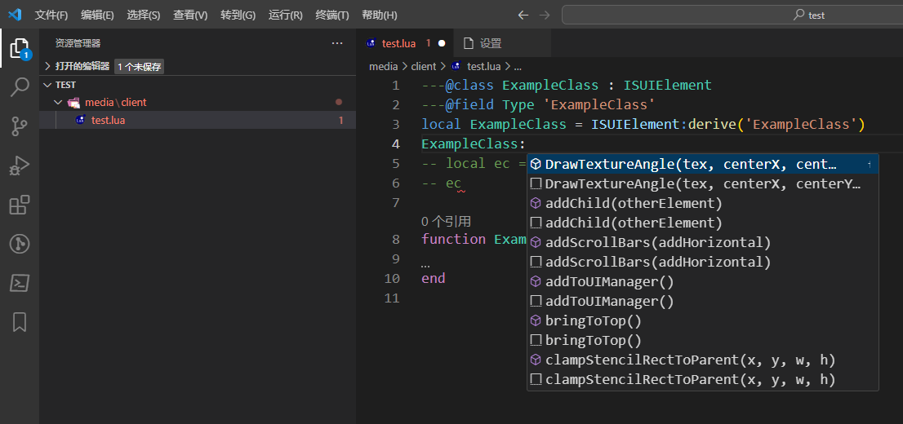
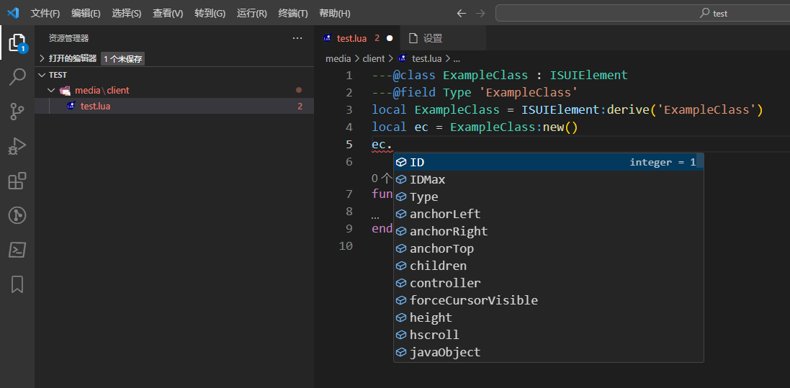
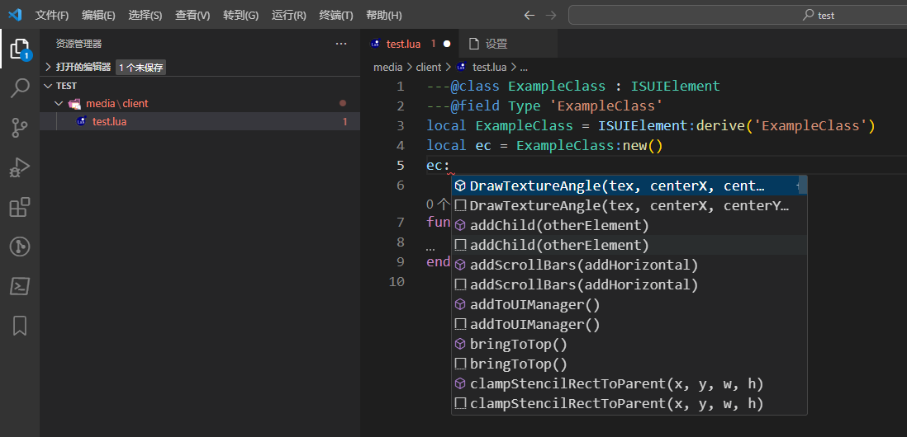

## 使用方式

1. 下载本仓库，复制 typesEnhancement 文件夹到你认为合适的位置（例如在示例图中，放在了 E:\pz-mod\Umbrella\typesEnhancement）
2. 在 VSCode 中启用 sumneko.lua 扩展（是图中这个扩展，别弄错了）
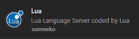
3. 打开 VSCode，在扩展设置中填入之前放好的 typesEnhancement 文件夹路径
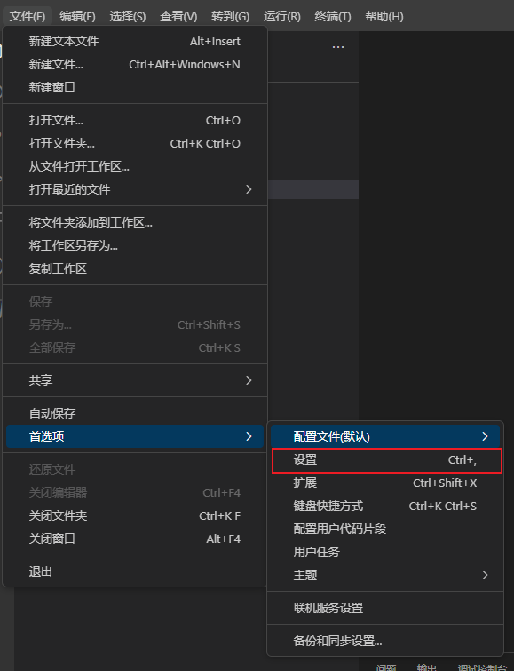
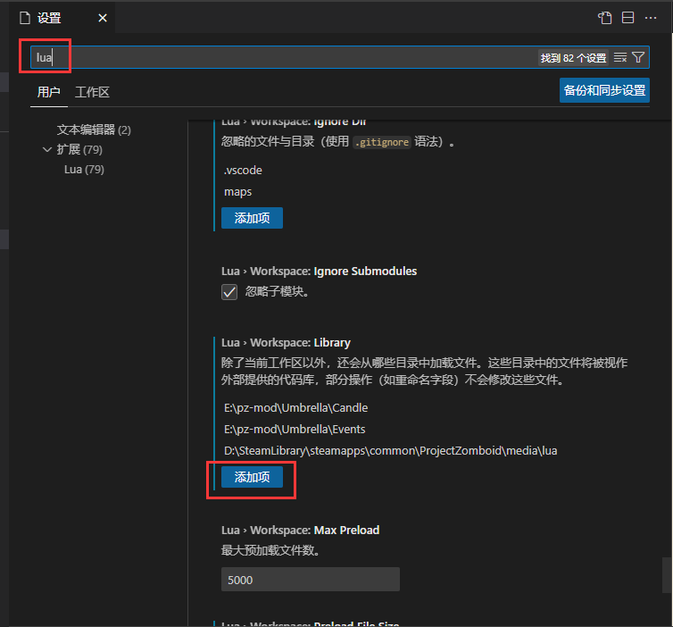
在这里填入你之前放好的 typesEnhancement 文件夹路径
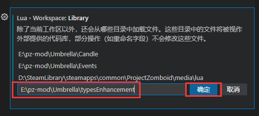
4. 打开你的 lua 文件，查看效果~（需要等类型提示加载完成）

另外，对于新声明的类型，推荐如下写法：

```lua
---@class ExampleClass : ISUIElement
---@field Type 'ExampleClass'
local ExampleClass = ISUIElement:derive('ExampleClass')
```

原因见 Q1 和 Q2

## Q&A

Q1: 提示如下内容该怎么办：不能在 `XXX` 的引用中注入字段 `aaa` 。如要允许注入，请对 `XXX` 使用 `---@class` 。Lua 诊断(inject-field)

A1: 在 XXX 上方添加 `---@class XXX : YYY`，`YYY` 是 `XXX` 的父类。示例：
```lua
---@class ExampleClass : ISUIElement
local ExampleClass = ISUIElement:derive('ExampleClass')
```

Q2: 类 Type 字段的值显示不正常，如图：
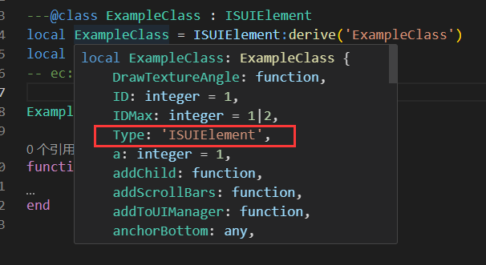

A2: 添加 `@field Type` 注释。示例：
```lua
---@class ExampleClass : ISUIElement
---@field Type 'ExampleClass'
local ExampleClass = ISUIElement:derive('ExampleClass')
```

Q3: 效果展示图中，VSCode lua 设置中的  `E:\pz-mod\Umbrella\Candle` 和 `E:\pz-mod\Umbrella\Events` 是什么？

A3: 这些是来自 [Umbrella](https://github.com/asledgehammer/Umbrella) 仓库，关于原版 java 代码、事件、lua 代码的类型提示。我没有用lua 代码的提示，改为直接引用游戏中的 lua 代码目录，感觉会更方便些~（不过对应的版本有点旧，大概是 v41.53 版本的？会缺少一些类型提示，不过我没找到更新的版本，有好心人找到新版本的话，能不能告诉我一下QwQ）

## 构建方式

当僵尸毁灭工程更新后，但本项目的类型提示文件依旧停留在旧版本时，你可以通过手动构建来获取新版本的类型提示增强。（Linux下应该也能构建，不过我没试过hhh）

1. 安装 nodejs

2. 复制 types_gen.js 到僵尸毁灭工程游戏目录下的 media/lua 文件夹下，如图

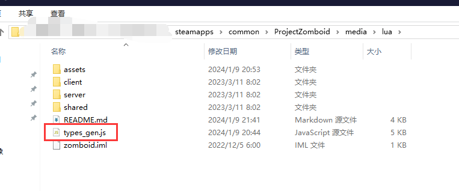

3. 在命令行中跳转到该目录下，执行 node types_gen.js，生成的 typesEnhancement 文件夹就是相应的 类型提示增强

4. 玩的开心QwQ
